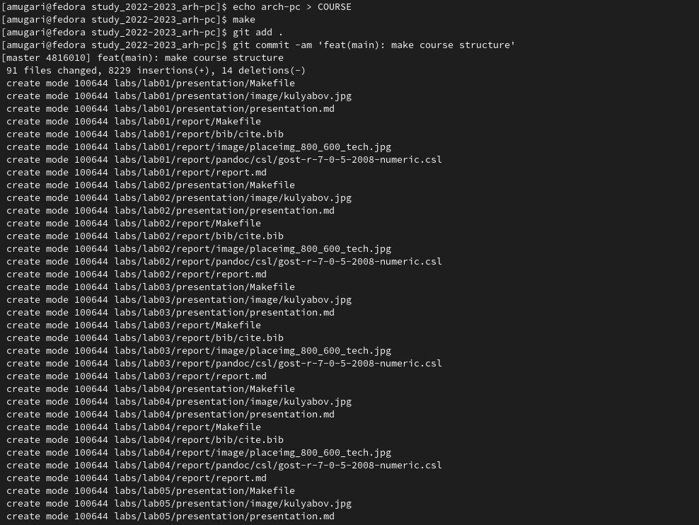

---
## Front matter
title: "Шаблон отчёта по лабораторной работе №3"
author: "Мугари Абдеррахим, НКАбд-03-22"

## Generic otions
lang: ru-RU
toc-title: "Содержание"

## Bibliography
bibliography: bib/cite.bib
csl: pandoc/csl/gost-r-7-0-5-2008-numeric.csl

## Pdf output format
toc: true # Table of contents
toc-depth: 2
lof: true # List of figures
lot: true # List of tables
fontsize: 12pt
linestretch: 1.5
papersize: a4
documentclass: scrreprt
## I18n polyglossia
polyglossia-lang:
  name: russian
  options:
	- spelling=modern
	- babelshorthands=true
polyglossia-otherlangs:
  name: english
## I18n babel
babel-lang: russian
babel-otherlangs: english
## Fonts
mainfont: PT Serif
romanfont: PT Serif
sansfont: PT Sans
monofont: PT Mono
mainfontoptions: Ligatures=TeX
romanfontoptions: Ligatures=TeX
sansfontoptions: Ligatures=TeX,Scale=MatchLowercase
monofontoptions: Scale=MatchLowercase,Scale=0.9
## Biblatex
biblatex: true
biblio-style: "gost-numeric"
biblatexoptions:
  - parentracker=true
  - backend=biber
  - hyperref=auto
  - language=auto
  - autolang=other*
  - citestyle=gost-numeric
## Pandoc-crossref LaTeX customization
figureTitle: "Рис."
tableTitle: "Таблица"
listingTitle: "Листинг"
lofTitle: "Список иллюстраций"
lotTitle: "Список таблиц"
lolTitle: "Листинги"
## Misc options
indent: true
header-includes:
  - \usepackage{indentfirst}
  - \usepackage{float} # keep figures where there are in the text
  - \floatplacement{figure}{H} # keep figures where there are in the text
---

# Цель работы

- В этой лабораторной работе мы познакомимся с git - системой контроля версий, где
мы получим некоторые практические навыки о том, как обращаться и использовать
этот инструмент (**git**).

# Выполнение лабораторной работы
## Настройка github:

- В нашем случае мы будем использовать GitHub, поэтому вам необходимо
создать учетную запись в https://github.com где будут заполнены основные
данные(рис. [-@fig:fig1])

{#fig:fig1 width=100%}

## Базовая настройка git:

-Здесь нам нужно настроить его с помощью некоторых команд через наш
терминал.(рис. [-@fig:fig2])
-Сначала нам нужно было ввести наше имя пользователя и адрес
электронной почты, с помощью которого мы создали наш репозиторий.(рис. [-@fig:fig2])
-Настроили utf-8 в выводе сообщений git.(рис. [-@fig:fig2])
-Мы задали имя начальной ветки (мы назвали её master).(рис. [-@fig:fig2])
-Конфигурация autocrlf.(рис. [-@fig:fig2])
-Конфигурация safecrlf.(рис. [-@fig:fig2])

{#fig:fig2 width=100%}

## Создание SSH ключа:

- Здесь нам нужно было сгенерировать пару ключей (открытый и закрытый)
Для последующей идентификации пользователя на сервере репозитория
(рис. [-@fig:fig3]).
- После генерации ключей они были сохранены по пути
"/home/amugari/.ssh/" (рис. [-@fig:fig3]).

{#fig:fig3 width=100%}

- Нам пришлось скопировать открытый ключ из локальной консоли, но
команда "xclip" не была установлена, поэтому нам пришлось установить ее, чтобы мы могли скопировать ключ (рис. [-@fig:fig4]).

{#fig:fig4 width=70%}

- после установки команды мы скопировали открытый ключ, затем в
настройках нашей учетной записи github в разделе "Ключи SSH и PGP"
мы создали новый SSH-ключ, который назвали "Лабораторная работа"(рис. [-@fig:fig5]) (рис. [-@fig:fig6]).

{#fig:fig5 width=100%}

{#fig:fig6 width=80%}

## Сознание рабочего пространства и репозитория курса на основе шаблона:

- На этом шаге нам нужно было создать рабочее пространство и
репозиторий курса на основе шаблона, поэтому через терминал мы
создали каталог для предмета "Архитектура компьютера", следуя
необходимой иерархии(рис. [-@fig:fig7]).

{#fig:fig7 width=100%}

## Сознание репозитория курса на основе шаблона:

- здесь, чтобы создать репозиторий курсов на основе шаблона, нам
пришлось использовать уже созданный шаблон в github пользователем
"yamadharma"(рис. [-@fig:fig8]).

{#fig:fig8 width=100%}

- После выбора шаблона мы должны были дать нашему репозиторию имя,
которое было "study_2022–2023_arh-pc", а затем мы создали репозиторий
из шаблона(рис. [-@fig:fig9]).

{#fig:fig9 width=70%}

- Затем через терминал мы переместились в каталог курса, после чего
клонировали только что созданный репозиторий(рис. [-@fig:fig10]).

{#fig:fig10 width=70%}

## Настройка каталога курса:

- Чтобы настроить каталог "**Курс**", мы переместились в каталог
"*~/work/study/2022-2023/"Архитектура компьютера"/study_2022-2023_arh-pc*",
затем мы удалили файл "**package.json**"(рис. [-@fig:fig11]).

{#fig:fig11 width=100%}

- затем мы создали необходимый каталог и отправили все файлы на
сервер для обновления(рис. [-@fig:fig12]) (рис. [-@fig:fig13])..

{#fig:fig12 width=100%}

{#fig:fig13 width=100%}

- мы зашли в рабочее пространство в локальном репозитории и на
странице github, где мы нашли все правильно(рис. [-@fig:fig14]) (рис. [-@fig:fig15])

{#fig:fig14 width=100%}

{#fig:fig15 width=100%}

## выводы по результатам выполнения заданий:

- к концу лабораторной работы мы узнали о системе контроля версий
git, получили некоторые практические навыки обращения с этим
инструментом (**git**) и его использования.

# Задание для самостоятельной работы:

- Здесь мы скопировали наши последние отчеты в нужные каталоги(рис. [-@fig:fig16])

{#fig:fig16 width=100%}

- затем отправил все обновления в git(рис. [-@fig:fig17])

{#fig:fig17 width=100%}

## выводы по результатам выполнения заданий:

- После выполнения этих упражнений мы смогли применить на
практике наши знания, которые мы получили о git и системе
контроля версий в целом.

# Выводы, согласованные с целью работы:

- к концу лабораторной работы мы узнали о системе контроля версий
git, получили некоторые практические навыки обращения с этим
инструментом (git) и его использования, после выполнения этих
упражнений мы смогли применить на практике наши знания,
которые мы получили о git и системе контроля версий в целом.

