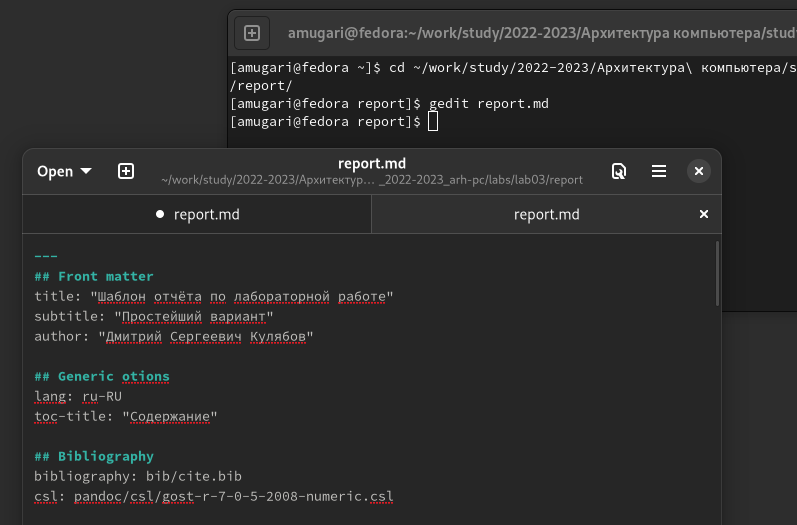

---
## Front matter
title: "Шаблон отчёта по лабораторной работе №4"
author: "Мугари Абдеррахим , НКАбд-03-22"

## Generic otions
lang: ru-RU
toc-title: "Содержание"

## Bibliography
bibliography: bib/cite.bib
csl: pandoc/csl/gost-r-7-0-5-2008-numeric.csl

## Pdf output format
toc: true # Table of contents
toc-depth: 2
lof: true # List of figures
lot: true # List of tables
fontsize: 12pt
linestretch: 1.5
papersize: a4
documentclass: scrreprt
## I18n polyglossia
polyglossia-lang:
  name: russian
  options:
	- spelling=modern
	- babelshorthands=true
polyglossia-otherlangs:
  name: english
## I18n babel
babel-lang: russian
babel-otherlangs: english
## Fonts
mainfont: PT Serif
romanfont: PT Serif
sansfont: PT Sans
monofont: PT Mono
mainfontoptions: Ligatures=TeX
romanfontoptions: Ligatures=TeX
sansfontoptions: Ligatures=TeX,Scale=MatchLowercase
monofontoptions: Scale=MatchLowercase,Scale=0.9
## Biblatex
biblatex: true
biblio-style: "gost-numeric"
biblatexoptions:
  - parentracker=true
  - backend=biber
  - hyperref=auto
  - language=auto
  - autolang=other*
  - citestyle=gost-numeric
## Pandoc-crossref LaTeX customization
figureTitle: "Рис."
tableTitle: "Таблица"
listingTitle: "Листинг"
lofTitle: "Список иллюстраций"
lotTitle: "Список таблиц"
lolTitle: "Листинги"
## Misc options
indent: true
header-includes:
  - \usepackage{indentfirst}
  - \usepackage{float} # keep figures where there are in the text
  - \floatplacement{figure}{H} # keep figures where there are in the text
---

# Цель работы

В этой лабораторной работе мы рассмотрим более простой способ написания лабораторного отчета с использованием облегченного языка разметки ***Markdown***.

# Выполнение лабораторной работы

- Прежде всего, мы открываем терминал и переходим в каталог, созданный во время выполнения третьего круга, когда мы обновляем и загружаем изменения из удаленного репозитория с помощью команды **git pull**. (рис. [-@fig:fig1])

{#fig:fig1 width=110%}

\
\

- Затем мы перешли к каталогу с шаблоном для лабораторного отчета № 4. Затем мы скомпилировали шаблон, используя **Makefile** с помощью команды **make**. (рис. [-@fig:fig2])

{#fig:fig2 width=110%} 

\
\

- После успешной компиляции мы получили два файла **report.docx** и **report.pdf** , мы смогли проверить это, используя как команду **ls**, так и **графический файловый менеджер**. (рис. [-@fig:fig3]) (рис. [-@fig:fig4])

{#fig:fig3 width=110%}

{#fig:fig4 width=110%} 

- После этого мы удалили созданные файлы с помощью **makefile ** с помощью команды **make clean** и мы проверили, что файлы действительно были удалены с помощью команды **ls**. (рис. [-@fig:fig5])

{#fig:fig5 width=110%} 

- Когда мы открыли файл **report.md** используя программу чтения **gedit** и внимательно прочитайте ее содержимое, чтобы понять ее структуру, но при вводе команды **gedit** не был установлен, поэтому нам пришлось сначала установить его. (рис. [-@fig:fig6]) (рис. [-@fig:fig7])

{#fig:fig6 width=110%} 

{#fig:fig7 width=70%} 

-После этого мы заполнили отчет **report.md** и скомпилировал выходные данные.(рис. [-@fig:fig8]) (рис. [-@fig:fig9])

{#fig:fig8 width=110%} 

{#fig:fig9 width=70%} 

\

- Затем нам нужно было поместить созданные файлы в ваш удаленный репозиторий, поэтому мы перешли в локальный репозиторий и ввели следующие команды, как указано в (рис. [-@fig:fig10])

{#fig:fig10 width=80%} 

## выводы по результатам выполнения заданий

- В этой лабораторной работе мы узнали, как создавать отчеты о файлах с помощью команды **makefile** и как их снова удалять, а также в целом, как использовать легковесный язык разметки **Markdown**.

# Задание для самостоятельной работы

- В этой части работы первое, что нам нужно сделать, это перейти в правильный каталог, который после этого был выделен для третьей лаборатории, и с помощью команды **gedit** мы запустили файл **report.md** итак, мы можем приступить к подаче третьего отчета. (рис. [-@fig:fig11]) (рис. [-@fig:fig12])

{#fig:fig11 width=100%} 

{#fig:fig12 width=80%} 

- После этого мы заполнили отчет по результатам работы, проделанной в третьей лаборатории.

# Список литературы{.unnumbered}

::: {#refs}
:::
