---
## Front matter
title: "Шаблон отчёта по лабораторной работе №10"
author: "Мугари Абдеррахим , НКАбд-03-22"

## Generic otions
lang: ru-RU
toc-title: "Содержание"

## Bibliography
bibliography: bib/cite.bib
csl: pandoc/csl/gost-r-7-0-5-2008-numeric.csl

## Pdf output format
toc: true # Table of contents
toc-depth: 2
lof: true # List of figures
lot: true # List of tables
fontsize: 12pt
linestretch: 1.5
papersize: a4
documentclass: scrreprt
## I18n polyglossia
polyglossia-lang:
  name: russian
  options:
	- spelling=modern
	- babelshorthands=true
polyglossia-otherlangs:
  name: english
## I18n babel
babel-lang: russian
babel-otherlangs: english
## Fonts
mainfont: PT Serif
romanfont: PT Serif
sansfont: PT Sans
monofont: PT Mono
mainfontoptions: Ligatures=TeX
romanfontoptions: Ligatures=TeX
sansfontoptions: Ligatures=TeX,Scale=MatchLowercase
monofontoptions: Scale=MatchLowercase,Scale=0.9
## Biblatex
biblatex: true
biblio-style: "gost-numeric"
biblatexoptions:
  - parentracker=true
  - backend=biber
  - hyperref=auto
  - language=auto
  - autolang=other*
  - citestyle=gost-numeric
## Pandoc-crossref LaTeX customization
figureTitle: "Рис."
tableTitle: "Таблица"
listingTitle: "Листинг"
lofTitle: "Список иллюстраций"
lotTitle: "Список таблиц"
lolTitle: "Листинги"
## Misc options
indent: true
header-includes:
  - \usepackage{indentfirst}
  - \usepackage{float} # keep figures where there are in the text
  - \floatplacement{figure}{H} # keep figures where there are in the text
---

# Цель работы :

В этой лабораторной работе мы научимся писать программы с использованием подпрограмм и познакомимся со способами отладки с использованием GDB и его основными функциями

# Выполнение лабораторной работы :

##  Реализация циклов в NASM :

1. Здесь мы начали с создания каталога для программаы лабораторной работы №10, а затем переместились в десятой каталог лаборатории "*~/work/arch-pc/lab10*", после чего мы создали файл "**lab10-1.asm**". (рис. [-@fig:1])

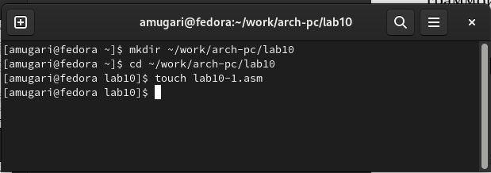{#fig:1 width=100% }

2. Затем мы заполнили код нашей программы в файле **lab10-1.asm**.(рис. [-@fig:2])

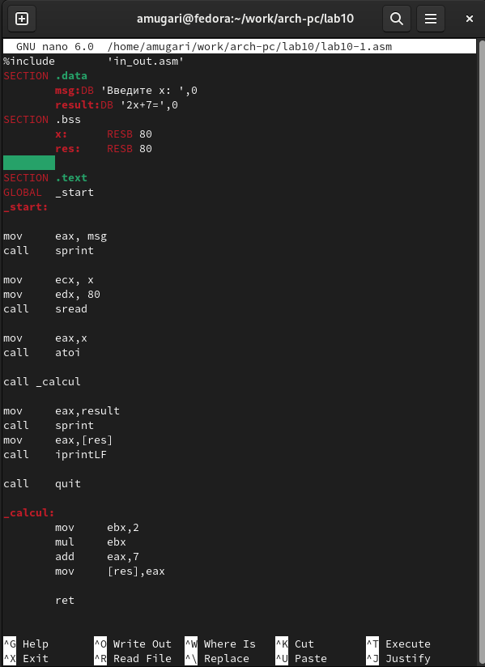{#fig:2 width=100% }

- После этого мы скомпилировали файл, создали исполняемый файл и проверили его работу.(рис. [-@fig:3])

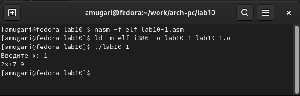{#fig:3 width=100% }

- Мы внесли изменения в наш код ,чтобы она вычислила это уравнение  $𝑓(𝑔(𝑥))$, где $𝑥$ вводится с клавиатуры и $𝑓(𝑥) = 2𝑥 + 7, 𝑔(𝑥) = 3𝑥 − 1$ а затем создали исполняемый файл.(рис. [-@fig:4]) (рис. [-@fig:5]) 

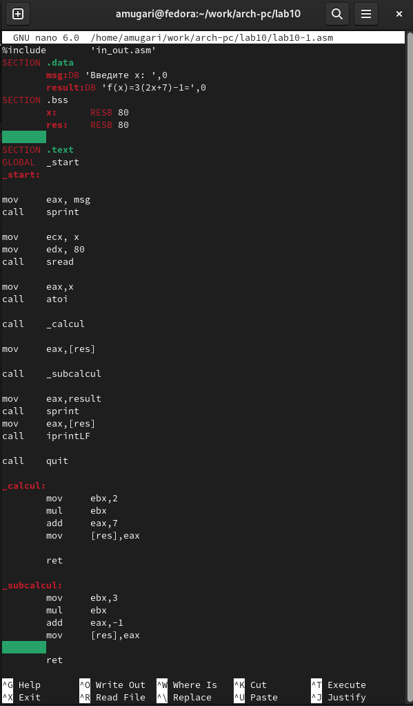{#fig:4 width=100% }

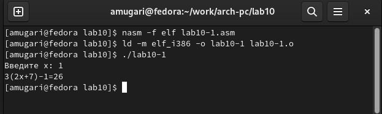{#fig:5 width=100% }

## Отладка программам с помощью GDB :

1. На этом шаге мы создали файл **lab10-2.asm** с текстом программы из **листинга 10.2**. ((*Программа печати сообщений Hello world!*). (рис. [-@fig:6])

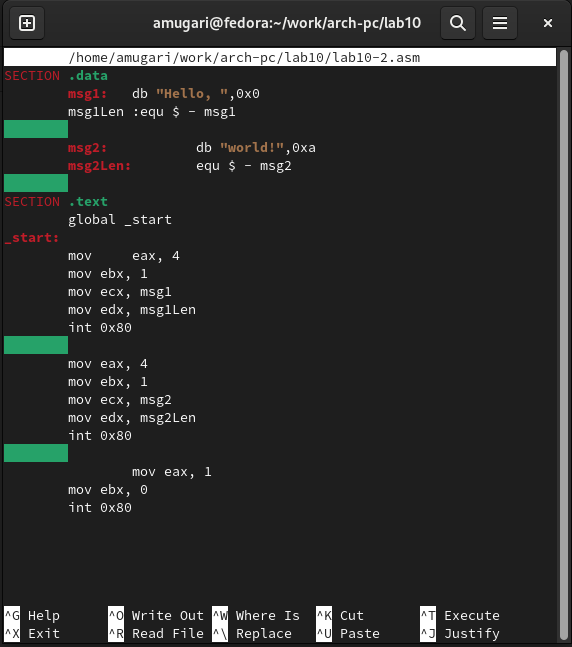{#fig:6 width=100% }

2. После этого мы скомпилировали файл, создали исполняемый файл.Затем мы загрузили исполняемый файл в **отладчик GDM**. (рис. [-@fig:7])

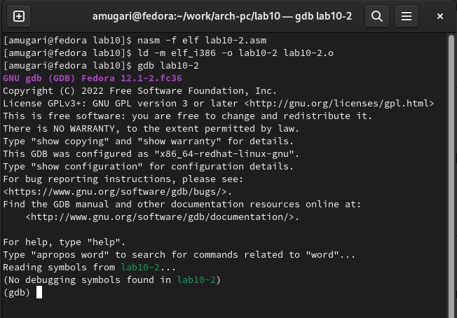{#fig:7 width=100% }

3. затем мы проверили работу программы, запустив ее в оболочке GDB с помощью команды **run**. (рис. [-@fig:8])

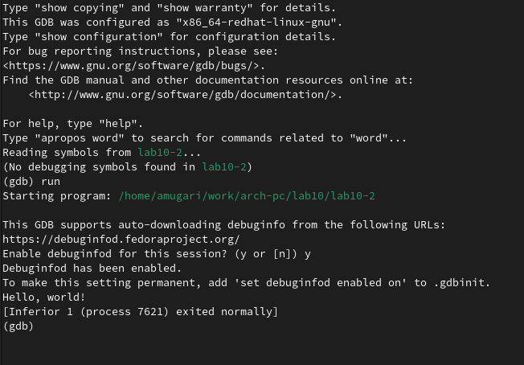{#fig:8 width=100% }

4. затем мы установили точку останова на метке **_start**, которая запускает выполнение любой программы на ассемблере, и запустили ее. (рис. [-@fig:9])

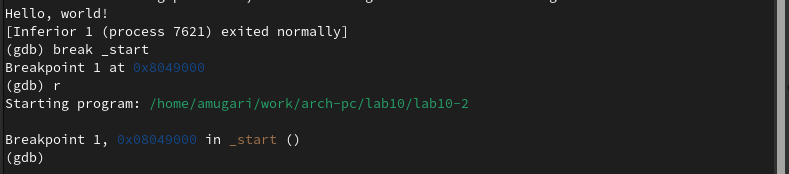{#fig:9 width=100% }

5. Затем мы просмотрели разобранный программный код, используя команду **disassemble**, начинающуюся с метки **_start**. (рис. [-@fig:10])

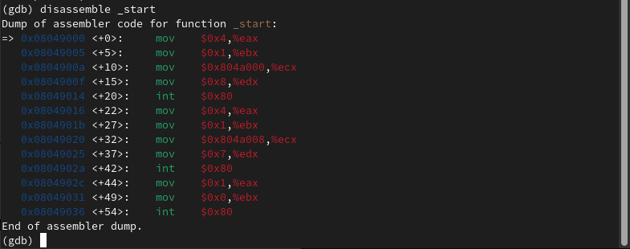{#fig:10 width=100% }

6. после этого мы переключились на отображение команд с **синтаксисом Intel**, введя команду **set disassembly-flavor intel**. (рис. [-@fig:11])

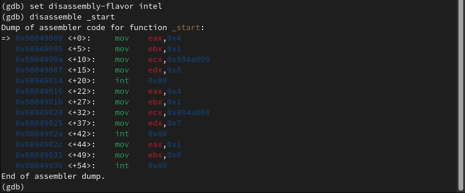{#fig:11 width=100% }

- Разница в синтаксисе между **AT&T** и **INTEL** заключается в том, что **AT&T** использует синтаксис **mov $0x4,%eax**, который популярен среди пользователей **Linux**, с другой стороны, **INTEL** использует синтаксис **mov eax,0x4** , который является популярен среди пользователей Windows.

7. Затем мы включили псевдографический режим для более удобного анализа программы. (рис. [-@fig:12])

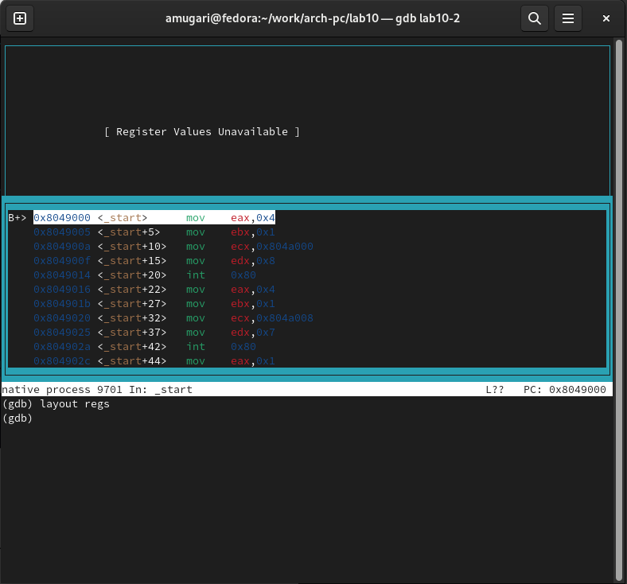{#fig:12 width=100% }

## Добавление точек останова : 

1. Мы проверили точку останова с помощью информационных точек останова. (рис. [-@fig:13])

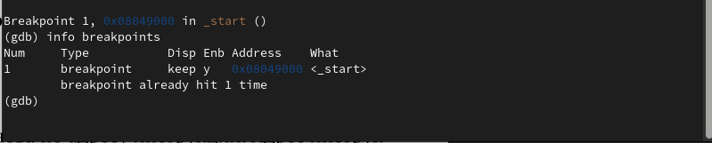{#fig:13 width=100% }

2. Mы определили адрес предпоследней инструкции (**mov ebx,0x0**) и установили точку останова.(рис. [-@fig:14])

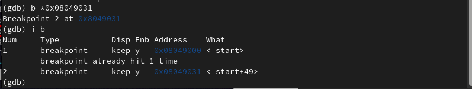{#fig:14 width=100% }

## Работа с данными программы в GDB : 

1. На этом шаге мы следовали 5 инструкциям, используя командный шаг i, и отслеживали изменение значений регистров, но перед этим мы проверили предыдущие значения регистров.(рис. [-@fig:15]) (рис. [-@fig:16])

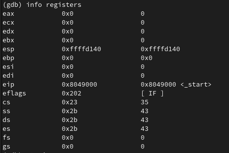{#fig:15 width=100% }

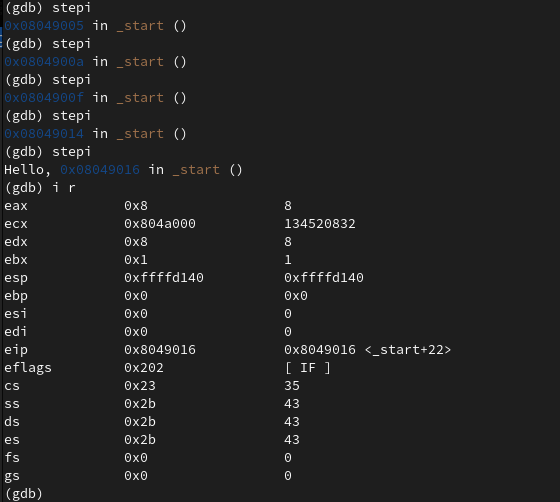{#fig:16 width=100% }

- После проверки мы видим, что регистры : **eax,ecx,edx,ebx,esp** изменили свое значение.

2. Mы рассмотрели значение переменной msg1 по имени, используя команду **x/1sb**(рис. [-@fig:17])

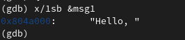{#fig:17 width=60% }

3. Здесь мы рассмотрели значение переменной msg2, используя адрес.(рис. [-@fig:18])

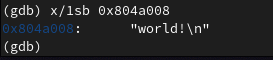{#fig:18 width=60% }

4. Здесь мы изменили первую букву переменной **msg1**, которая имеет тип **char**.(рис. [-@fig:19])

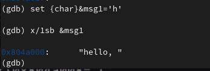{#fig:19 width=100% }

5. После этого мы изменили первую букву переменной **msg2**.(рис. [-@fig:20])

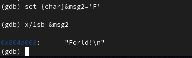{#fig:20 width=100% }

6. Затем мы выводим значение регистра **edx** в различных форматах (шестнадцатеричном, двоичном и символьном).(рис. [-@fig:21])

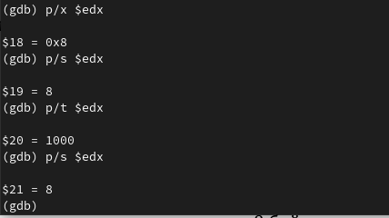{#fig:21 width=100% }

7. Используя команду **set**, мы изменили значение регистра **ebx**, когда раз, введя '2', а в другой раз, введя **2**.(рис. [-@fig:22])

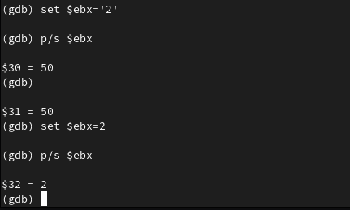{#fig:22 width=100% }

- но когда мы напечатали значение регистра, мы получили значение **50** и это потому, что машина интерпретировала введенное значение как символ, и в таблице **ASCII** символ '2' имеет значение **50** в десятичной системе, но когда мы ввели значение **2** машина интерпретировала **2** как число в десятичной системе.

8. Наконец, мы завершили программу с помощью **stepi** и вышли из GDB с помощью команды **quit**.(рис. [-@fig:23])

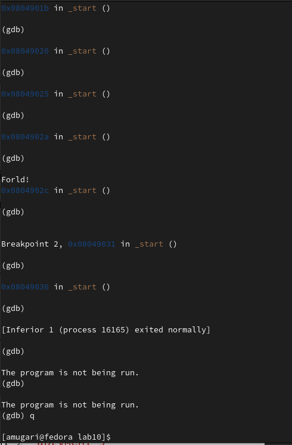{#fig:23 width=100% }

## Обработка аргументов командной строки в GDB :

1. На этом этапе мы скопировали файл **lab9-2.asm**, созданный при выполнении лабораторной работы **№9** с программой, отображающей аргументы командной строки на экране (листинг 9.2), в файл с именем **lab 10-3.asm**, а затем мы скомпилировали этот файл и установил точку останова в **_start** и запустил отладчик.(рис. [-@fig:24])

{#fig:24 width=100% }

2. Затем мы посмотрели на остальные позиции стека – адрес в памяти, где находится имя программы, находится в *[esp + 4]*, адрес первого аргумента хранится в *[esp +8]*, в *[esp +12]*.(рис. [-@fig:25])

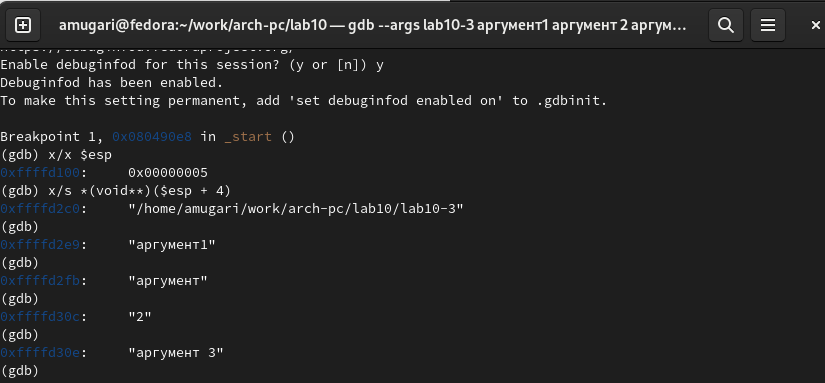{#fig:25 width=100% }

- Шаг изменения адреса равен 4, потому что размер регистра **esp** равен **32битам = 4  байтам**, а количество памяти равно количеству аргументов плюс имя программы, поэтому мы получили 5 шагов с 4 байтами для каждого шага.(рис. [-@fig:26])

{#fig:26 width=60% }

## Выводы по результатам выполнения заданий :

- В этой части работы мы узнали, как работать с отладчиком GDB, и получили более близкое представление о том, как работают подпрограммы.

# Задание для самостоятельной работы :

## Выводы по результатам выполнения заданий :

- В этой части мы узнали, как превратить программу в подпрограмму, но у нас возникла проблема с подпрограммой **atoi **, поэтому мы не смогли вычислить результат.

# Выводы, согласованные с целью работы :

- В этой лабораторной работе мы научимся писать программы с использованием подпрограмм и познакомимся со способами отладки с использованием GDB и его основными функциями
